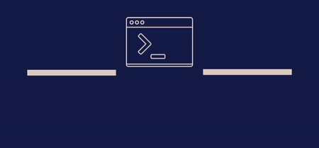

<h1 align="center">
   
  
</h1>

  <image src="https://img.shields.io/badge/Maintained%3F-yes-green.svg"/>
  <image src="https://img.shields.io/website-up-down-green-red/http/monip.org.svg"/>
  <image src="http://ForTheBadge.com/images/badges/built-with-love.svg"/>
  <image src="https://img.shields.io/github/forks/shravan20/production-ready-boilerplates.svg"/>
  <image src="https://img.shields.io/github/stars/shravan20/production-ready-boilerplates.svg"/>
  <image src="https://img.shields.io/github/license/shravan20/production-ready-boilerplates.svg"/>

<h4 align="center">Collections of Production Ready Frontend and Backend Boilerplates</h4>

